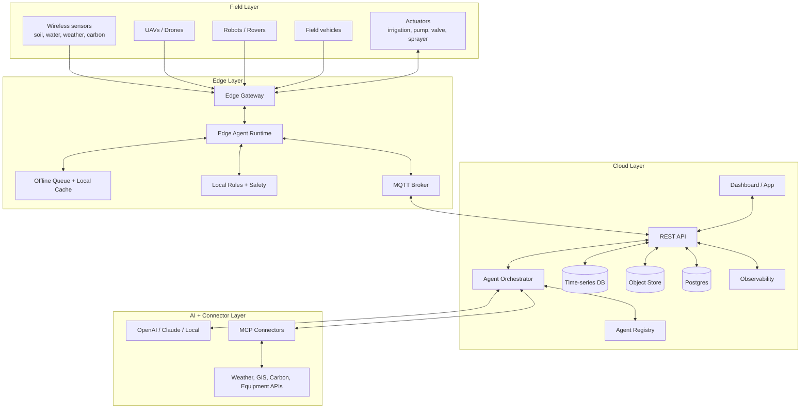

# AgriAgentMesh

**AgriAgentMesh** is a production-oriented starter repository for building an **Internet of Agents for agriculture**: a secure, reusable agent mesh that connects cloud services, edge gateways, field sensors, UAVs, robots, vehicles, carbon monitoring devices, and human operators.

The goal is not to ship one rigid farm product. The goal is to give farmers, researchers, startups, and system integrators a clean skeleton they can adapt to their own crop, field, hardware, network, and AI provider.

## What this repository gives you

- A reusable **cloud-edge-field architecture** for smart agriculture automation.
- A vendor-neutral **agent registry** with capability cards.
- Pluggable model adapters for **OpenAI**, **Anthropic Claude**, or a local model service.
- MCP-ready connector scaffolding for external tools, farm platforms, GIS, weather, carbon accounting, and equipment APIs.
- MQTT + REST event flow for low-latency field telemetry and cloud workflows.
- Safety guardrails for physical actuation, UAV missions, irrigation, spraying, and vehicle commands.
- Starter agents for monitoring, mission planning, UAVs, robots, irrigation, carbon, weather, safety, and reporting.
- Docker Compose, Kubernetes skeleton, CI, schemas, prompts, and examples.

## Reference deployment pattern



## Agent roster

| Agent | Runs | Purpose | Typical tools |
|---|---:|---|---|
| `field-monitor-agent` | Edge + cloud | Detect field anomalies from sensor, weather, and image-derived events | MQTT, time-series DB, GIS |
| `uav-mission-agent` | Cloud + edge | Plan, validate, and monitor drone missions | mission API, weather, geofence, docking API |
| `robot-ops-agent` | Edge | Coordinate robots and rovers for scouting, sampling, and payload tasks | ROS2/MAVLink/REST adapter |
| `irrigation-agent` | Edge | Recommend or trigger irrigation actions under policy | soil moisture, forecast, valve API |
| `carbon-agent` | Cloud + edge | Collect activity data and estimate farm carbon events | carbon factors, fuel logs, soil/sensor data |
| `vehicle-agent` | Edge + cloud | Track field vehicles and optimize routing or task assignment | GPS, CAN bus, fleet API |
| `safety-agent` | Cloud + edge | Enforce approval, geofence, weather, chemical, and equipment policies | policy engine, auth, audit log |
| `report-agent` | Cloud | Generate summaries for growers, researchers, auditors, and operators | DB, object store, LLM |

## Quick start

```bash
cp .env.example .env
make install
make dev
```

Then open:

- API: `http://localhost:8080/docs`
- MQTT: `localhost:1883`
- MinIO console: `http://localhost:9001`

Seed demo agents:

```bash
make seed
```

Run a simulated field event:

```bash
python examples/quickstart/simulation.py --scenario examples/field-crop-carbon/farm_profile.yaml
```

## Reuse guide for your own system

1. Copy `examples/field-crop-carbon/farm_profile.yaml` and describe your farm, fields, devices, communication links, crop, safety constraints, and automation goals.
2. Add or edit agent cards in `configs/agents/`.
3. Add hardware adapters under `packages/agri_agent_mesh/connectors/`.
4. Add safety rules in `configs/policies/safety_policy.yaml`.
5. Choose an AI provider in `.env`: `openai`, `anthropic`, or `local`.
6. Start with recommendation-only mode. Enable physical actuation only after human approval workflows, field testing, and fail-safe validation.
7. Deploy cloud services using Docker Compose or Kubernetes. Deploy `apps/edge-agent` on a farm gateway, industrial PC, Jetson, Raspberry Pi, or other edge node.

## Provider selection

```env
LLM_PROVIDER=openai        # openai | anthropic | local
OPENAI_API_KEY=...
ANTHROPIC_API_KEY=...
LOCAL_MODEL_URL=http://localhost:11434/v1/chat/completions
```

## Safety stance

This repository is built for agricultural decision support and controlled automation. For any command that can move hardware, open valves, spray chemicals, affect livestock, dispatch UAVs, or operate vehicles, use:

- explicit authorization,
- geofencing,
- weather checks,
- equipment readiness checks,
- rate limits,
- audit logging,
- emergency stop handling,
- human-in-the-loop approval for high-risk actions.

## Repository layout

```text
apps/                       Runtime services
packages/agri_agent_mesh/   Shared Python package
configs/                    Agent cards, farm profiles, policies
docs/                       Architecture and deployment guidance
examples/                   Reusable scenarios and simulations
schemas/                    JSON schemas for interoperability
prompts/                    Copy-paste prompts for builders and agents
k8s/                        Kubernetes starter manifests
scripts/                    Bootstrap and seed utilities
tests/                      Unit tests
```

## License

Apache-2.0. Replace the license if your organization needs another public release model.


## Related Work

This repository is grounded in prior IoT + smart agriculture + edge infrastructure research:

1. N. Ahmed, D. De and I. Hussain, "Internet of Things (IoT) for Smart Precision Agriculture and Farming in Rural Areas," *IEEE Internet of Things Journal*, 2018, doi: 10.1109/JIOT.2018.2879579.
2. Nurzaman Ahmed, Nadia Shakoor, "Advancing agriculture through IoT, Big Data, and AI: A review of smart technologies enabling sustainability," *Smart Agricultural Technology*, 2025, doi: 10.1016/j.atech.2025.100848.
3. M. Alam, N. Ahmed, R. Matam, M. Mukherjee and F. A. Barbhuiya, "SDN-Based Reconfigurable Edge Network Architecture for Industrial Internet of Things," *IEEE Internet of Things Journal*, 2023, doi: 10.1109/JIOT.2023.3268375.

See [`docs/CITATIONS.md`](docs/CITATIONS.md) and [`CITATION.cff`](CITATION.cff).
